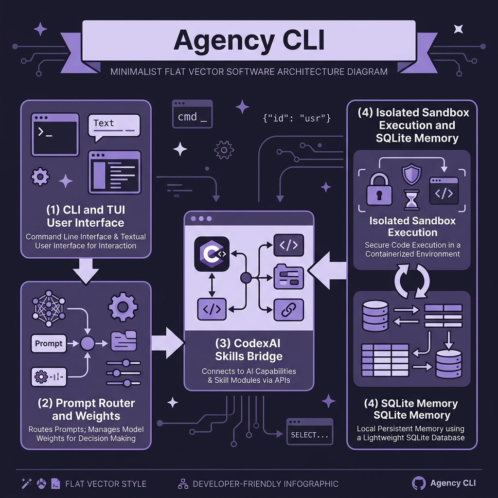

# ⚡ Agency CLI

Terminal-native CLI and interactive TUI wrapping the CodexAI Skills pack as its execution kernel. Features interactive chat interfaces, agent routing, workspace indexing, automated task execution, and a memory dashboard.



<p align="center">
  
  
  
  
  
  
</p>

---

## Table of Contents

- [What Is Agency CLI](#what-is-agency-cli)
- [System Requirements](#system-requirements)
- [Installation](#installation)
  - [Option A: Automated Setup (Recommended)](#option-a-automated-setup-recommended)
  - [Option B: Manual Setup](#option-b-manual-setup)
  - [Verify Installation](#verify-installation)
- [Two Modes: TUI and CLI](#two-modes-tui-and-cli)
- [TUI Reference (`acg`)](#tui-reference-acg)
  - [Launching TUI](#launching-tui)
  - [Layout & Interactive Overlay Panels](#layout--interactive-overlay-panels)
  - [Slash Commands](#slash-commands)
  - [Inline Features](#inline-features)
  - [Visual Themes](#visual-themes)
  - [Environment Flags](#environment-flags)
- [CLI Reference (`agency`)](#cli-reference-agency)
  - [Core Commands](#core-commands)
  - [LLM & Config Commands](#llm--config-commands)
  - [Workflow & Scheduling Commands](#workflow--scheduling-commands)
  - [Agent & Sandboxing Commands](#agent--sandboxing-commands)
  - [Telemetry & Evaluation Commands](#telemetry--evaluation-commands)
- [LLM Provider Configuration](#llm-provider-configuration)
- [Token Budget Policy](#token-budget-policy)
- [Feature Flags (Hardening Profile)](#feature-flags-hardening-profile)
- [Project Architecture](#project-architecture)
  - [Monorepo Packages](#monorepo-packages)
  - [Directory Layout](#directory-layout)
  - [Local State Files](#local-state-files)
- [Scripts Reference](#scripts-reference)
- [Publishing & Pre-release Pipeline](#publishing--pre-release-pipeline)
- [License](#license)

---

## What Is Agency CLI

Agency CLI is a local-first development tool that connects your code workspace to AI agents. It integrates three core pillars:

1. **Routing**: Analyzes prompts and directs them to the correct CodexAI skill utilizing a keyword router with self-learning feedback weights.
2. **Execution**: Spawns sandboxed subprocesses, runs multi-step workflows, task plans, and concurrent agent dispatches against your codebase files.
3. **Interface**: Provides an interactive terminal user interface (TUI) with chat, file context injection, themes, sessions, and live LLM streaming.

---

## System Requirements

| Requirement | Minimum | Recommended |
|:---|:---|:---|
| **Node.js** | `v22.x` | `v22.x` (LTS) |
| **PNPM** | `v9.0.0` | Latest `v9.x` |
| **Python** | `3.x` | `3.11+` |
| **Shell** | PowerShell 5.1 (Windows) | PowerShell 7+ / Bash / Zsh |
| **Docker** | Optional | For sandboxed `agency run` |
| **GitHub CLI (`gh`)** | Optional | For `agency git pr` status check |

---

## Installation

### Option A: Automated Setup (Recommended)

Run the bootstrap installer script in the workspace root:

```powershell
.\scripts\install.ps1
```

> [!NOTE]
> **What the installer does under the hood:**
> 1. Verifies that `pnpm` is installed and global binaries are mapped.
> 2. Resolves all workspace dependencies via `pnpm install`.
> 3. Compiles all 16 TypeScript packages via `pnpm build`.
> 4. Links `@agency/cli` globally so `agency` and `acg` binaries are available system-wide.
> 5. Configures a clean shortcut function `acg` in your PowerShell `$PROFILE` (free of absolute hardcoded paths).
> 6. Installs Playwright Chromium binaries for browser automation.
> 7. Initializes the workspace configuration and builds the knowledge graph via `agency setup`.

*After installation, open a **new terminal** for the updated PATH environment variables to take effect.*

### Option B: Manual Setup

If you prefer to configure the packages manually:

```bash
pnpm install
pnpm build
cd packages/cli
pnpm link --global
agency setup --project-root ../..
```

### Verify Installation

Run the 9-step integration smoke test to check all binaries:

```powershell
pnpm smoke
```

The smoke suite validates: compilation, test suite execution, project setup, config generation, workspace indexing, prompt routing, workflow dry-runs, subagent listing, egress proxy security checks, and packaging dry-runs.

---

## Two Modes: TUI and CLI

Agency CLI acts as both an interactive interface and a headless automation shell:

*   **Interactive TUI (`acg` / `agency` without args)**: alternate-screen workspace with rich overlays, fuzzy autocomplete, session browser, and chat.
*   **Headless CLI (`agency <subcommand>`)**: commander-driven interface for CI/CD scripting, headless prompts, diagnostics, and batch updates.

---

## TUI Reference (`acg`)

### Launching TUI

```powershell
acg                              # Target the current working directory
acg D:\your\target-project       # Target a specific directory
agency                           # Alternative alias (no subcommand launches TUI)
agency --project-root D:\path    # Explicit project root target
```

### Layout & Interactive Overlay Panels

The TUI maintains view of your main chat context while you toggle system details by using interactive side/overlay panels:

| Trigger / Command | Panel | Description |
|:---|:---|:---|
| `?` or `Ctrl+H` | **Help & Shortcuts** | Lists all keyboard navigation keys and slash command aliases. |
| `/sessions` | **Sessions Manager** | Browse, search, restore, or delete previous conversation histories. |
| `/connect` | **Connections Manager** | Dynamically configure LLM providers and save your API keys securely. |
| `/models` | **Model Selector** | Switch between configured models and active AI providers on the fly. |
| `/skills` | **Skills Picker** | Browse local CodexAI skills, inspect actions, and inject them into chat context. |
| `/mcp` | **MCP Console** | View active MCP server statuses, tool registrations, and environment variables. |
| `Ctrl+X` | **Subagent Inspector** | Focus on running subagent instances to inspect their progress details. |
| `/variant` | **Thinking Level** | Sets the reasoning/thinking budget for supported models. |
| `/status` | **System Status** | View the system status dashboard, feature flags, and SQLite database stats. |

### Slash Commands

Type these in the prompt bar to trigger actions:

| Command | Alias | What It Does |
|:---|:---|:---|
| `/help` | `/h` | Opens the help overlay. |
| `/new` | `/clear` | Starts a fresh session, clearing routing caches. |
| `/sessions` | `/session`, `/resume` | Opens the session picker. |
| `/themes` | | Lists available visual themes. |
| `/theme <name>` | | Switches theme (e.g. `/theme daylight`). |
| `/index` | | Rebuilds the workspace index. |
| `/export` | `/x` | Exports current session to Markdown. |
| `/compact` | | Archives old session context. |
| `/connect` | | Opens connections overlay. |
| `/models` | `/model` | Opens model selector overlay. |
| `/model info` | `/model spec` | Prints current model specifications. |
| `/model probe` | | Probes the active model capabilities and saves overrides. |
| `/skills` | `/skill` | Opens skills picker overlay. |
| `/plugins` | `/plugin` | Opens plugin manager overlay. |
| `/review` | | Opens code review menu (supports `/review commit`, `branch`, `pr`). |
| `/status` | `/viewstatus` | Opens the system status dashboard. |
| `/mcp` | | Opens MCP console. |
| `/route feedback <intent>`| | Records a routing weights correction. |
| `/goal <desc>` | | Launches a long-running autonomous task loop. |
| `/schedule <interval> <task>`| | Adds a recurring schedule. |
| `/agents` | | Opens sub-agent management panel. |
| `/project` | | Opens workspace directory picker. |
| `/dashboard` | `/memory` | Opens the HTML knowledge dashboard in your browser. |
| `/exit` | `/quit`, `/q` | Exits the TUI. |

### Inline Features

*   **`@` File Autocomplete**: Type `@` followed by a file name in the prompt to search and inject the file's contents into the agent's workspace context.
*   **`!` Shell Commands**: Prefix with `!` to run shell commands inline. Output is captured and printed in the chat log.
    ```
    !git status
    !pnpm test
    ```

### Visual Themes

Two built-in themes are supported (stored in `~/.agency/tui.json`):

*   `agency` (default): Dark mocha with lavender accents.
*   `daylight`: Solarized light with violet accents.

### Environment Flags

*   `AGENCY_TUI_SKIP_SPLASH=1`: Skips the boot animation.
*   `AGENCY_TUI_ANIMATIONS=0`: Disables shimmer, spinners, and typewriter outputs.
*   `AGENCY_TUI_SOUND=1`: Enables terminal bells on approvals.
*   `AGENCY_SKILLS_ROOT`: Override path to CodexAI skills.

---

## CLI Reference (`agency`)

Every headless command accepts `--project-root <path>` to target a workspace.

### Core Commands

#### `agency setup`
Indexes the workspace, creates `~/.agency/config.json` if missing, checks for LLM keys, and builds the knowledge graph.
```bash
agency setup
agency setup --force-index
agency setup --json --quiet
```

#### `agency index`
Builds or incrementally updates `.agency/index.json` and knowledge graphs.
```bash
agency index
agency index --force
```

#### `agency status`
Inspects runtime state: resolved feature flags, event journal status, memory size, tasks list, active agents, and SQLite database stats.
```bash
agency status
agency status --json
```

#### `agency chat`
Routes the prompt via CodexAI, queries the provider, and prints/streams response.
```bash
agency chat "fix auth test"
agency chat "explain code" --stream
agency chat "what workflow fits?" --no-llm
agency chat "task" --max-loops 5 --budget deep
```
*   `--provider <id>`: Override provider.
*   `--no-llm`: Skip LLM query; outputs routing intent & suggested commands only.
*   `--budget <tight|normal|deep>`: Limits context file count and output tokens.
*   `--stream`: Streams tokens to stdout.
*   `--json`: Machine-readable JSON output.
*   `--quiet`: Suppress routing metadata logs on stderr.
*   `--max-loops <n>`: Maximum tool execution loops.

#### `agency route`
Routes a prompt through CodexAI, showing matched intent and suggested workflows without calling any LLM.
```bash
agency route "debug flaky database test"
```

#### `agency routing`
Manage self-learning prompt router weights.
```bash
agency routing weights
agency routing feedback --prompt "fix database" --intent debug
```

#### `agency skill`
List, inspect, and invoke individual CodexAI skills.
```bash
agency skill list
agency skill show plan-writer
agency skill invoke $plan
```

### LLM & Config Commands

#### `agency config`
Manage global configuration file at `~/.agency/config.json`.
```bash
agency config init
agency config init --force
agency config path
```

#### `agency browser`
Check or invoke browser automation via Cursor IDE Browser MCP.
```bash
agency browser status
agency browser open "https://news.ycombinator.com"
agency browser open "https://news.ycombinator.com" --system
```

### Workflow & Scheduling Commands

#### `agency workflow`
List and run multi-step CodexAI workflow script chains.
```bash
agency workflow list
agency workflow run create --yes
agency workflow run plan --prompt "plan refactoring" --preflight --yes
```

#### `agency schedule`
Local workflow scheduler. Schedules are saved in `.agency/schedules.json`.
```bash
agency schedule list
agency schedule add --workflow create --every 5m
agency schedule add --workflow plan --cron "0 9 * * *" --require-approval
agency schedule remove <id>
agency schedule run --yes
```

#### `agency task`
Execute task plans with checkpoint save/resume.
```bash
agency task start plan.md
agency task start plan.md --from 3 --gate-every 5
agency task resume <checkpoint-id>
agency task list
```

### Agent & Sandboxing Commands

#### `agency agents`
Dispatch autonomous subagents. Logs are saved in `.agency/agents/dispatch-<ts>.json`.
```bash
agency agents list
agency agents dispatch planner --task "Draft implementation plan"
agency agents parallel --dispatches-file dispatches.json
```
*   `parallel` clones the workspace into isolated temporary directories for concurrent execution, then merges changes.

#### `agency run`
Execute shell commands with safety checks and sandboxing options.
```bash
agency run "pnpm test"                            # Native host execution
agency run "npm install" --sandbox-mode docker    # Docker sandbox
agency run "risky-cmd" --docker-network-disabled  # Network blocked sandbox
```

#### `agency team`
Manage local team profiles and approval policies (stored in `.agency/team.json`).
```bash
agency team init --name "Backend Team"
agency team member add --id dev1 --name "Alice" --role dev
```

### Telemetry & Evaluation Commands

#### `agency eval`
Runs task-evaluation suites to test agent performance against baselines.
```bash
agency eval
agency eval --agent --suite hard --update-baseline
```

#### `agency replay`
Replays the recorded event journal (`.agency/events/journal.db`) and verifies payload hashes against `payloadHash` to guarantee integrity.
```bash
agency replay
```

#### `agency replay-regression`
Runs behaviour-trace regression checks over recorded traces.
```bash
agency replay-regression --list
agency replay-regression <trace-id>
```

#### `agency handover`
Generate `.agency/handover.md` context summaries.
```bash
agency handover --print
```

#### `agency compact`
Compresses and cleans old session files.
```bash
agency compact --yes
```

#### `agency graph`
Renders the workspace knowledge graph summaries.
```bash
agency graph
```

---

## LLM Provider Configuration

Configuration resides at `~/.agency/config.json`. Keys support environment variable expansion at runtime.

Example `~/.agency/config.json`:

```json
{
  "defaultProvider": "openrouter",
  "providers": {
    "openrouter": {
      "apiKey": "${OPENROUTER_API_KEY}",
      "model": "anthropic/claude-3.5-sonnet"
    },
    "openai": {
      "apiKey": "${OPENAI_API_KEY}",
      "model": "gpt-4o"
    },
    "google": {
      "apiKey": "${GOOGLE_API_KEY}",
      "model": "gemini-1.5-pro"
    },
    "local": {
      "baseUrl": "http://127.0.0.1:11434/v1",
      "model": "llama3"
    }
  }
}
```

---

## Token Budget Policy

The `--budget` flag determines context injection volume and output limits:

| Budget | Context Files | Max Output Tokens | Route Cache |
|:---|:---|:---|:---|
| `tight` | 0 | 512 | Yes |
| `normal` (default) | Up to 3 | 1024 | Yes |
| `deep` | Up to 6 | 2048 | No |

---

## Feature Flags (Hardening Profile)

Feature flags gate the production-hardening safeguards. Toggle profiles using the `AGENCY_PROFILE` env variable (`"legacy"` or `"hardened"`).

| Flag Name | Default (Hardened) | Description |
|:---|:---|:---|
| `persistEvents` | `true` | Save EventBus publishes to durable SQLite database. |
| `autoRecover` | `true` | Attempt to auto-resume interrupted tasks on startup. |
| `approvalInToolPath`| `enforce` | Gating write/destructive tools via the approval engine. |
| `delegationGuards` | `true` | Restrict maximum agent delegation nesting and cycle depths. |
| `maxCrashLoops` | `3` | Max crash-resume attempts before task escalation. |
| `executionBudgetMs` | `300000` | Wall-clock execution budget per agent. |
| `memorySemantic` | `true` | Vector + FTS Reciprocal Rank Fusion hybrid retrieval. |
| `checkpointStrict` | `true` | Verify SQLite task checkpoint checksum integrity. |
| `atomicRollback` | `true` | Roll back half-applied multi-file changes atomically if interrupted. |
| `secretScan` | `true` | Redact secrets in memory; quarantine secret-bearing vectors. |
| `verifyLoop` | `true` | Run verify -> self-correct loop on subagent code writes. |
| `contextCompaction` | `true` | Proactively compact conversations exceeding 70% of context window. |

---

## Project Architecture

### Monorepo Packages

Managed via PNPM workspaces, the repository comprises 16 internal packages:

| Package | Description |
|:---|:---|
| `@agency/cli` | Commander-based CLI entry point. Registers all subcommands and bin scripts. |
| `@agency/tui` | React Ink alternate-screen terminal UI. Manages view overlays, input loops, and shortcuts. |
| `@agency/core` | Core logic: routing, workflows, EventBus, task scheduling. |
| `@agency/providers` | LLM API connectors, streaming logic, token budgeting, and cost supervisors. |
| `@agency/skills-bridge`| Bridge loading `plugin-tools.json`, resolving skill aliases, and executing python scripts. |
| `@agency/security` | Sandboxing runner, process jail interfaces, and egress network filters. |
| `@agency/memory` | SQLite episodic memory database and semantic vector indexes. |
| `@agency/workspace` | Staging directory manager & lock files. |
| `@agency/governance` | Token budget management and provider billing guards. |
| `@agency/heuristics` | Command safety diagnostics and loop prevention algorithms. |
| `@agency/telemetry` | Tracing, execution profiling, and event log replayers. |
| `@agency/benchmark` | Evaluation suites measuring routing accuracy and agent execution metrics. |
| `@agency/tooling` | Schema parsing, coercion, and MCP tool registry. |
| `@agency/contracts` | TypeScript interfaces and shared schemas. |
| `@agency/context` | Environment variables and file path loading. |
| `@agency/browser` | Cursor IDE browser automation plugin drivers. |

### Directory Layout

```
agency-cli/
  packages/
    cli/                 # Commander parser & binary entries
    tui/                 # React Ink terminal UI panels
    core/                # Routing, workflows, EventBus, task scheduling
    providers/           # LLM adapters (Google, OpenAI, Anthropic, local)
    skills-bridge/       # Python CodexAI script bridge
    security/            # Docker sandboxing, egress proxies, process jails
    memory/              # SQLite database + vector embeddings
    workspace/           # Staging directory manager & lock files
    governance/          # Cost tracking & budget supervisor
    heuristics/          # Loop prevention & safety hooks
    telemetry/           # Profiling, tracing, event logs
    benchmark/           # Evaluation suites
    tooling/             # Schemas & MCP tooling
    contracts/           # Shared types
    context/             # Paths & env loaders
    browser/             # Browser drivers
  scripts/
    install.ps1          # Automated setup + PowerShell profiles shortcut
    smoke.ps1            # 9-step package smoke verification
    publish.ps1          # Clean checks and npm publishing pipeline
  assets/                # Repository graphics assets
  tests/                 # Fixtures and mock data
```

### Local State Files

These files are created in your workspace during operation:

| Path | Purpose |
|:---|:---|
| `.agency/index.json` | Incremental workspace file index for TUI `@` references. |
| `.agency/knowledge/knowledge-graph.json` | Graph representation of workspace files and skill mappings. |
| `.agency/knowledge/index.html` | Interactive HTML dashboard visualization. |
| `.agency/routing-weights.json` | Dynamic weight matrix used by prompt routing. |
| `.agency/schedules.json` | Saved cron schedule intervals. |
| `.agency/team.json` | Team structure and approval policies. |
| `.agency/sessions/` | Persisted chat session Markdown and JSON files. |
| `.agency/events/journal.db` | SQLite event journal. |
| `~/.agency/config.json` | Global provider settings. |

---

## Scripts Reference

*   **`install.ps1` (`.\scripts\install.ps1`)**: Complete setup including global path binding, browser download, package install, and PowerShell profile shortcut setup.
*   **`smoke.ps1` (`pnpm smoke`)**: Runs smoke tests validating compilation, testing, indexing, and routing.
*   **`publish.ps1` (`pnpm publish:dry` / `pnpm publish:release`)**: Bumps version, compiles, runs tests, publishes packages in dependency order, and tags Git releases.

---

## Publishing & Pre-release Pipeline

The release script enforces strict pre-release gates:

1. **Working Directory Clean Check**: Rejects execution if uncommitted changes exist (override in dry-runs).
2. **Branch Check**: Rejects releases on branches other than `main` or `master`.
3. **Automated Testing & Compilation**: Runs `pnpm -r test` and `pnpm -r build` before releasing.
4. **Dependency-order Publishing**: Publishes packages sequentially to resolve peer-dependencies:
   `providers` -> `core` -> `skills-bridge` -> `tui` -> `cli`
5. **Git Tagging**: Creates a release tag `v<version>` and pushes it automatically.

---

## License

[MIT](LICENSE) - Copyright (c) 2026 Agency CLI contributors
